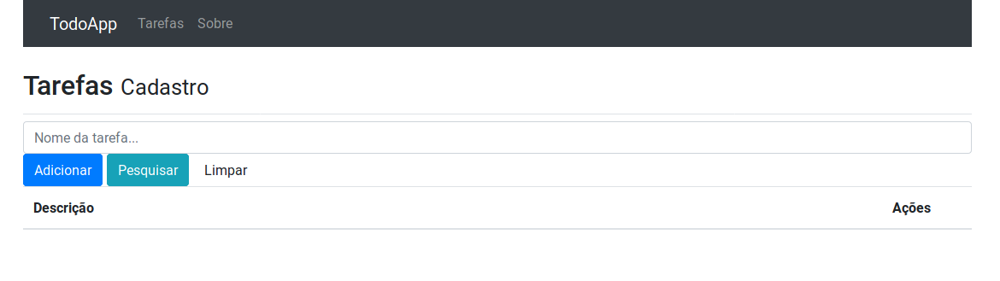

## Sobre o projeto

Aplicação de lista de tarefas (back-end e front-end) desenvovildo para fixação de conteúdos relacionados a Express.js, MongooDB, React.js e Redux.

Observação: Este projeto foi feito inicialmente, com base no curso [Curso React + Redux: Fundamentos](https://www.udemy.com/course/react-redux-pt/), até o commit [7ee4bf](https://github.com/robsonsilv4/todo-app/commit/7ee4bfd96ee3493dcafae764c3886290cbc94ac6).

## Desafios e aprendizados

O curso utilizava dependências datadas de 2 anos anteriores ao início deste repositório, então resolvi assumir o desafio de segui-lo utilizando as versões mais recentes e com isso, adiquirindo lições que considero essenciais a todo desenvolvedor, por exemplo:

- Ler documentações
- Pesquisar por erros
- Substistuir bibliotecas depreciadas
- Lidar com mudanças que são críticas para o código

### Feito com

Back-end:

- [Express](https://expressjs.com/pt-br/)
- [Node-restful](https://github.com/baugarten/node-restful)
- [Body-parser](https://www.npmjs.com/package/body-parser)
- [Mongoose](https://mongoosejs.com/docs/)
- [MongoDB](https://www.mongodb.com/)
- [Nodemon](https://nodemon.io/)
- [Pm2](https://pm2.keymetrics.io/)

Front-end:

- [React](https://pt-br.reactjs.org/)
- [React-dom](https://pt-br.reactjs.org/docs/react-dom.html)
- [React-redux](https://react-redux.js.org/introduction/quick-start)
- [React-router-dom](https://www.npmjs.com/package/react-router-dom)
- [Axios](https://medium.com/codingthesmartway-com-blog/getting-started-with-axios-166cb0035237)
- [Bootstrap](https://getbootstrap.com/)
- [Redux](https://redux.js.org/)
- [Redux-multi](https://www.npmjs.com/package/redux-multi)
- [Redux-promise](https://www.npmjs.com/package/redux-promise)
- [Redux-thunk](https://www.npmjs.com/package/redux-thunk)
